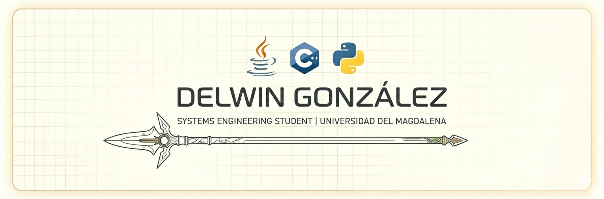

# ¡Hola! Mi nombre es Delwin González 👋

---
### 🛠️ Perfil Técnico
* 🎓 **Academia:** 6to Semestre de Ingeniería de Sistemas | Universidad del Magdalena.
* 🖥️ **Especialidad:** Solución de problemas.
* ✨ **Filosofía:** Principios **SOLID** y patrones de diseño.
* ⚙️ **Scripting:** Automatización de flujos de trabajo con **AutoHotkey** y **Tampermonkey**.

### 💻 Stack Tecnológico
| Categoría | Herramientas |
| :--- | :--- |
| **Lenguajes** |    |
| **IDEs / Tools** | `IntelliJ IDEA` • `VS Code` • `Git` • `Maven` |
| **Data & Analysis** | `SQL Server (SSMS)` • `Jupyter` • `Anaconda` |

### 👤 Sobre mí
* **Personalidad:** Poseo un perfil social y alegre, manteniendo un alto compromiso y madurez en la entrega de resultados.
* **Autogestión:** Investigador nato; disfruto profundizar en nuevas tecnologías de forma independiente para refinar mis habilidades actuales.

---
*Navegando por la ingeniería, un commit a la vez.*